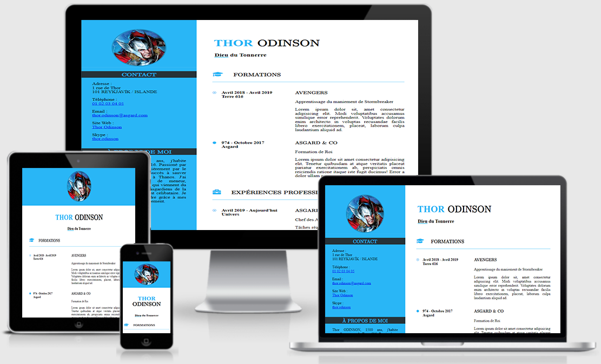

# Projet n°1 : Transformer une maquette en site web avec HTML et CSS

## :mag: Aperçu

## :bookmark_tabs: Sommaire
<ol>
    <li><a href="#sujet">Sujet</a></li>
    <li><a href="#demandes_respecter">Demandes à respecter</a></li>
    <li><a href="#objectifs_projet">Objectifs du projet</a></li>
    <li><a href="#technologies_utilisees">Technologies utilisées</a></li>
    <li><a href="#prerequis">Prérequis</a></li>
    <li><a href="#installation">Installation</a></li>
    <li><a href="#utilisation_siteweb">Utilisation du site web</a></li>
    <li><a href="#auteurs_contributeurs">Auteurs et contributeurs</a></li>
    <li><a href="#licence">Licence</a></li>
</ol>

## :page_facing_up: 1. Sujet 

Votre CV n'est pas tout à fait à jour. Avant de rencontrer un client potentiel, vous décidez de créer votre propre site web, sur lequel vous publierez votre CV.

Vous choisissez de développer votre site en HTML et CSS.

Pour éviter de payer un serveur, vous décidez d’héberger votre site sur GitHub Pages. Vous créez donc immédiatement un compte pour tester ce service.

Satisfait de la simplicité du processus, vous faites encore quelques recherches sur les critères d’un bon CV en ligne, et choisissez finalement de créer un modèle.

## :memo: 2. Demandes à respecter 

* Intégrer du contenu conformément à une maquette.
* Préparer des éléments graphiques et textuels à intégrer à une page web.
* Adapter l'affichage du site web à des écrans de petite taille.
* Utiliser un système de gestion de versions pour le suivi du projet et son hébergement.
* Définir la structure du site web à partir d'une maquette.
* Assurer la conformité du site web aux standards HTML et CSS.

## :checkered_flag: 3. Objectifs du projet 

Apprendre à utiliser HTML et CSS tout en respectant les bonnes nomenclatures et pratiques.

## :computer: 4. Technologies utilisées 

* HTML
* CSS
* Git & GitHub

## :exclamation: 5. Prérequis 

Aucun

## :wrench: 6. Installation 

Cloner ce repository.

## :question: 7. Utilisation du site web 

Ouvrir le fichier index.html sur un navigateur web.

## :beers: 8. Auteurs et Contributeurs 

Timoté Lancelle : [GitHub](https://github.com/LancelleTimote) / [LinkedIn](https://www.linkedin.com/in/timote-lancelle-devweb/)

## :page_with_curl: 9. Licence 

Distribué sous la licence MIT. Voir le fichier [LICENSE](LICENSE) pour plus d'informations.